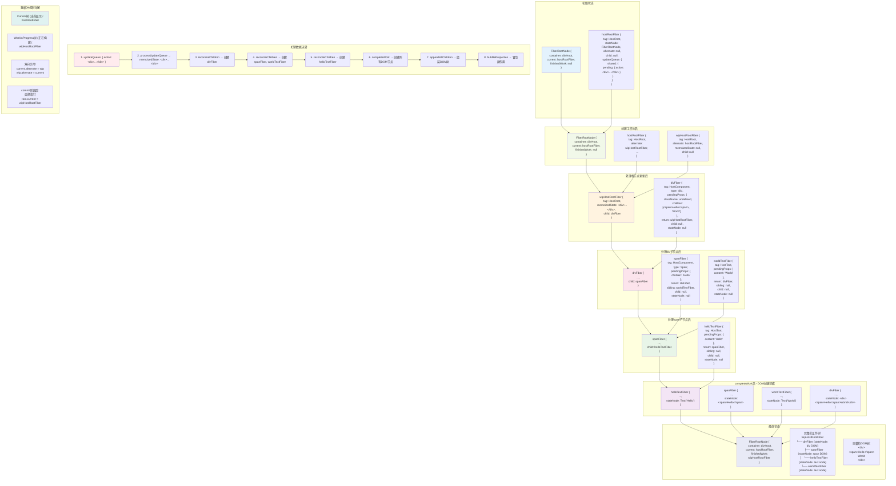

# React Reconciler 详尽流程图

本文档包含了React Reconciler的详细流程图，展示了从用户调用到完成渲染的完整过程。

## 目录

1. [完整技术流程图](#1-完整技术流程图) - 最详细最准确的流程图
2. [具体示例流程图](#2-具体示例流程图) - 以实际例子展示执行过程
3. [模块交互时序图](#3-模块交互时序图) - 展示各模块间的调用顺序
4. [数据结构变化图](#4-数据结构变化图) - 展示关键数据在各阶段的状态

---

## 1. 完整技术流程图

**这是最全面、最准确的流程图，推荐优先学习此图**

```mermaid
graph TD
    Start["用户调用 root.render(App)"] --> A1[createContainer]

    subgraph "阶段1: 容器初始化"
        A1 --> A2["new FiberNode(HostRoot, {}, null)"]
        A2 --> A3["new FiberRootNode(container, hostRootFiber)"]
        A3 --> A4[createUpdateQueue]
        A4 --> A5["hostRootFiber.updateQueue = queue"]
        A5 --> A6["返回 FiberRootNode"]
    end

    A6 --> B1["updateContainer(element, root)"]

    subgraph "阶段2: 触发更新"
        B1 --> B2["const hostRootFiber = root.current"]
        B2 --> B3["createUpdate(element)"]
        B3 --> B4["enqueueUpdate(updateQueue, update)"]
        B4 --> B5["scheduleUpdateOnFiber(hostRootFiber)"]
    end

    B5 --> C1[markUpdateFromFiberToRoot]

    subgraph "阶段3: 找到根节点"
        C1 --> C2["let node = fiber"]
        C2 --> C3["let parent = node.return"]
        C3 --> C4{"parent !== null?"}
        C4 -->|是| C5["node = parent, parent = node.return"]
        C5 --> C4
        C4 -->|否| C6{"node.tag === HostRoot?"}
        C6 -->|是| C7["return node.stateNode"]
        C6 -->|否| C8["return null"]
    end

    C7 --> D1["renderRoot(root)"]

    subgraph "阶段4: 准备工作栈"
        D1 --> D2["prepareFreshStack(root)"]
        D2 --> D3["createWorkInProgress(root.current, {})"]
        D3 --> D4{"wip = current.alternate"}
        D4 -->|null| D5["new FiberNode(tag, props, key)"]
        D4 -->|存在| D6[复用现有节点]
        D5 --> D7["建立双向引用"]
        D6 --> D7
        D7 --> D8["workInProgress = wip"]
    end

    D8 --> E1["workLoop()"]

    subgraph "阶段5: 工作循环"
        E1 --> E2{"workInProgress !== null?"}
        E2 -->|是| E3["performUnitOfWork(workInProgress)"]
        E2 -->|否| E4[循环结束]
    end

    E3 --> F1["beginWork(fiber)"]

    subgraph "阶段6: 递阶段 - beginWork"
        F1 --> F2{"fiber.tag"}
        F2 -->|HostRoot| F3["updateHostRoot(wip)"]
        F2 -->|HostComponent| F4["updateHostComponent(wip)"]
        F2 -->|HostText| F5["return null"]
        F2 -->|其他| F6["console.warn + return null"]

        F3 --> F7["const baseState = wip.memoizedState"]
        F7 --> F8["const updateQueue = wip.updateQueue"]
        F8 --> F9["const pending = updateQueue.shared.pending"]
        F9 --> F10["updateQueue.shared.pending = null"]
        F10 --> F11["processUpdateQueue(baseState, pending)"]
        F11 --> F12["wip.memoizedState = memoizedState"]
        F12 --> F13["reconcileChildren(wip, memoizedState)"]

        F4 --> F14["const nextProps = wip.pendingProps"]
        F14 --> F15["const nextChildren = nextProps.children"]
        F15 --> F16["reconcileChildren(wip, nextChildren)"]

        F13 --> F17["const current = wip.alternate"]
        F16 --> F17
        F17 --> F18{"current !== null?"}
        F18 -->|是| F19["reconcileChildFibers(wip, current.child, children)"]
        F18 -->|否| F20["mountChildFibers(wip, null, children)"]
    end

    F19 --> G1["ChildReconciler(true)"]
    F20 --> G2["ChildReconciler(false)"]

    subgraph "阶段7: 子节点协调"
        G1 --> G3[reconcileChildFibers函数]
        G2 --> G3
        G3 --> G4{"typeof newChild"}
        G4 -->|"object + REACT_ELEMENT_TYPE"| G5[reconcileSingleElement]
        G4 -->|"string/number"| G6[reconcileSingleTextNode]
        G4 -->|其他| G7["return null"]

        G5 --> G8["createFiberFromElement(element)"]
        G8 --> G9["fiber.return = returnFiber"]
        G9 --> G10["placeSingleChild(fiber)"]

        G6 --> G11["new FiberNode(HostText, {content}, null)"]
        G11 --> G12["fiber.return = returnFiber"]
        G12 --> G13["placeSingleChild(fiber)"]

        G10 --> G14{"shouldTrackEffects && fiber.alternate === null?"}
        G13 --> G14
        G14 -->|是| G15["fiber.flags |= Placement"]
        G14 -->|否| G16[不标记]
        G15 --> G17["return fiber"]
        G16 --> G17
    end

    G17 --> H1["fiber.memoizedProps = fiber.pendingProps"]
    H1 --> H2{"next === null?"}
    H2 -->|是| H3["completeUnitOfWork(fiber)"]
    H2 -->|否| H4["workInProgress = next, 回到workLoop"]

    H4 --> E2

    subgraph "阶段8: 归阶段 - completeWork"
        H3 --> H5["let node = fiber"]
        H5 --> H6["completeWork(node)"]
        H6 --> H7{"node.tag"}
        H7 -->|HostComponent| H8["Mount还是Update?"]
        H7 -->|HostText| H9["Mount还是Update?"]
        H7 -->|HostRoot| H10["bubbleProperties(wip)"]

        H8 -->|Mount| H11["createInstance(wip.type, newProps)"]
        H11 --> H12["appendAllChildren(instance, wip)"]
        H12 --> H13["wip.stateNode = instance"]
        H13 --> H14["bubbleProperties(wip)"]

        H9 -->|Mount| H15["createTextInstance(newProps.content)"]
        H15 --> H16["wip.stateNode = instance"]
        H16 --> H17["bubbleProperties(wip)"]

        H14 --> H18["const sibling = node.sibling"]
        H17 --> H18
        H10 --> H18

        H18 --> H19{"sibling !== null?"}
        H19 -->|是| H20["workInProgress = sibling, return"]
        H19 -->|否| H21["node = node.return, workInProgress = node"]

        H20 --> E2
        H21 --> H22{"node !== null?"}
        H22 -->|是| H6
        H22 -->|否| H23[completeUnitOfWork结束]
    end

    H23 --> E2
    E4 --> I1["root.finishedWork = root.current.alternate"]
    I1 --> I2[完成渲染]

    subgraph "DOM树构建详情"
        J1["appendAllChildren开始"]
        J1 --> J2["let node = wip.child"]
        J2 --> J3{"node !== null?"}
        J3 -->|否| J4[遍历结束]
        J3 -->|是| J5{"node是DOM节点?"}
        J5 -->|是| J6["appendInitialChild(parent, node.stateNode)"]
        J5 -->|否| J7{"node.child !== null?"}
        J7 -->|是| J8["向下寻找DOM节点"]
        J7 -->|否| J9[处理兄弟节点]
        J6 --> J9
        J8 --> J3
        J9 --> J10{"node.sibling存在?"}
        J10 -->|是| J11["node = node.sibling"]
        J10 -->|否| J12["向上回溯"]
        J11 --> J3
        J12 --> J3
    end

    subgraph "副作用冒泡详情"
        K1["bubbleProperties开始"]
        K1 --> K2["let subtreeFlags = NoFlags"]
        K2 --> K3["let child = wip.child"]
        K3 --> K4{"child !== null?"}
        K4 -->|是| K5["subtreeFlags |= child.subtreeFlags"]
        K5 --> K6["subtreeFlags |= child.flags"]
        K6 --> K7["child.return = wip"]
        K7 --> K8["child = child.sibling"]
        K8 --> K4
        K4 -->|否| K9["wip.subtreeFlags |= subtreeFlags"]
    end

    style Start fill:#e1f5fe
    style A1 fill:#f3e5f5
    style B1 fill:#e8f5e8
    style C1 fill:#fff3e0
    style D1 fill:#fce4ec
    style E1 fill:#e0f2f1
    style F1 fill:#f1f8e9
    style G3 fill:#e3f2fd
    style H3 fill:#fdf7e2
    style I2 fill:#e8eaf6
```

---

## 2. 具体示例流程图

```mermaid
graph TD
    subgraph "具体示例: 渲染 div-span-Hello-World"
        Ex1["用户代码: root.render(div-span-Hello-World)"]
    end

    Ex1 --> Stack1

    subgraph "调用栈详细展示"
        Stack1["1. updateContainer(element, root)"]
        Stack1 --> Stack2["2. scheduleUpdateOnFiber(hostRootFiber)"]
        Stack2 --> Stack3["3. renderRoot(root)"]
        Stack3 --> Stack4["4. workLoop()"]
        Stack4 --> Stack5["5. performUnitOfWork(hostRootFiber)"]
        Stack5 --> Stack6["6. beginWork(hostRootFiber)"]
        Stack6 --> Stack7["7. updateHostRoot(hostRootFiber)"]
        Stack7 --> Stack8["8. reconcileChildren(hostRootFiber, div元素)"]
        Stack8 --> Stack9["9. mountChildFibers(hostRootFiber, null, div元素)"]
        Stack9 --> Stack10["10. reconcileSingleElement(..., div元素)"]
        Stack10 --> Stack11["11. createFiberFromElement(div元素)"]
        Stack11 --> Stack12["返回: divFiber"]
    end

    Stack12 --> Tree1

    subgraph "第一轮工作循环完成 - Fiber树构建"
        Tree1["当前状态: hostRootFiber.child = divFiber, workInProgress = divFiber"]
    end

    Tree1 --> Loop2

    subgraph "第二轮工作循环 - 处理div节点"
        Loop2["performUnitOfWork(divFiber)"]
        Loop2 --> Loop3["beginWork(divFiber)"]
        Loop3 --> Loop4["updateHostComponent(divFiber)"]
        Loop4 --> Loop5["reconcileChildren(divFiber, [span元素, World文本])"]
        Loop5 --> Loop6["mountChildFibers(..., [span元素, World文本])"]
        Loop6 --> Loop7["处理第一个子节点: span元素"]
        Loop7 --> Loop8["createFiberFromElement(span元素)"]
        Loop8 --> Loop9["返回: spanFiber"]
    end

    Loop9 --> Tree2

    subgraph "第二轮完成 - 继续构建"
        Tree2["当前状态: divFiber.child = spanFiber, workInProgress = spanFiber"]
    end

    Tree2 --> Loop3_1

    subgraph "第三轮工作循环 - 处理span节点"
        Loop3_1["performUnitOfWork(spanFiber)"]
        Loop3_1 --> Loop3_2["beginWork(spanFiber)"]
        Loop3_2 --> Loop3_3["updateHostComponent(spanFiber)"]
        Loop3_3 --> Loop3_4["reconcileChildren(spanFiber, Hello文本)"]
        Loop3_4 --> Loop3_5["mountChildFibers(..., Hello文本)"]
        Loop3_5 --> Loop3_6["reconcileSingleTextNode(..., Hello文本)"]
        Loop3_6 --> Loop3_7["new FiberNode(HostText, {content: Hello}, null)"]
        Loop3_7 --> Loop3_8["返回: helloTextFiber"]
    end

    Loop3_8 --> Tree3

    subgraph "第三轮完成"
        Tree3["当前状态: spanFiber.child = helloTextFiber, workInProgress = helloTextFiber"]
    end

    Tree3 --> Loop4_1

    subgraph "第四轮工作循环 - 处理文本节点"
        Loop4_1["performUnitOfWork(helloTextFiber)"]
        Loop4_1 --> Loop4_2["beginWork(helloTextFiber)"]
        Loop4_2 --> Loop4_3["case HostText: return null"]
        Loop4_3 --> Loop4_4["next === null, 开始completeUnitOfWork"]
    end

    Loop4_4 --> Complete1

    subgraph "归阶段开始 - 完成文本节点"
        Complete1["completeUnitOfWork(helloTextFiber)"]
        Complete1 --> Complete2["completeWork(helloTextFiber)"]
        Complete2 --> Complete3["case HostText: createTextInstance(Hello)"]
        Complete3 --> Complete4["helloTextFiber.stateNode = textDOM(Hello)"]
        Complete4 --> Complete5["bubbleProperties(helloTextFiber)"]
        Complete5 --> Complete6["检查兄弟节点: helloTextFiber.sibling = null"]
        Complete6 --> Complete7["向上回溯: node = spanFiber"]
    end

    Complete7 --> Complete8

    subgraph "完成span节点"
        Complete8["completeWork(spanFiber)"]
        Complete8 --> Complete9["case HostComponent: createInstance(span, props)"]
        Complete9 --> Complete10["spanDOM = document.createElement(span)"]
        Complete10 --> Complete11["appendAllChildren(spanDOM, spanFiber)"]
        Complete11 --> Complete12["appendInitialChild(spanDOM, textDOM(Hello))"]
        Complete12 --> Complete13["spanFiber.stateNode = spanDOM"]
        Complete13 --> Complete14["bubbleProperties(spanFiber)"]
        Complete14 --> Complete15["检查兄弟节点: spanFiber.sibling = worldTextFiber"]
        Complete15 --> Complete16["workInProgress = worldTextFiber"]
    end

    Complete16 --> Loop5_1

    subgraph "处理World文本节点"
        Loop5_1["performUnitOfWork(worldTextFiber)"]
        Loop5_1 --> Loop5_2["beginWork(worldTextFiber): return null"]
        Loop5_2 --> Loop5_3["completeUnitOfWork(worldTextFiber)"]
        Loop5_3 --> Loop5_4["completeWork(worldTextFiber)"]
        Loop5_4 --> Loop5_5["createTextInstance(World)"]
        Loop5_5 --> Loop5_6["worldTextFiber.stateNode = textDOM(World)"]
        Loop5_6 --> Loop5_7["无兄弟节点，回溯到divFiber"]
    end

    Loop5_7 --> Complete17

    subgraph "完成div节点"
        Complete17["completeWork(divFiber)"]
        Complete17 --> Complete18["createInstance(div, props)"]
        Complete18 --> Complete19["divDOM = document.createElement(div)"]
        Complete19 --> Complete20["appendAllChildren(divDOM, divFiber)"]
        Complete20 --> Complete21["遍历divFiber的所有子节点"]
        Complete21 --> Complete22["appendInitialChild(divDOM, spanDOM)"]
        Complete22 --> Complete23["appendInitialChild(divDOM, textDOM(World))"]
        Complete23 --> Complete24["divFiber.stateNode = divDOM"]
        Complete24 --> Complete25["bubbleProperties(divFiber)"]
        Complete25 --> Complete26["无兄弟节点，回溯到hostRootFiber"]
    end

    Complete26 --> Complete27

    subgraph "完成根节点"
        Complete27["completeWork(hostRootFiber)"]
        Complete27 --> Complete28["case HostRoot: bubbleProperties(hostRootFiber)"]
        Complete28 --> Complete29["收集所有子树的副作用标记"]
        Complete29 --> Complete30["node = hostRootFiber.return = null"]
        Complete30 --> Complete31["completeUnitOfWork结束"]
    end

    Complete31 --> Final

    subgraph "最终状态"
        Final["workInProgress = null, workLoop结束, root.finishedWork = wipHostRootFiber, DOM树构建完成"]
    end

    subgraph "最终DOM结构"
        DOM1["divDOM: div元素, 包含: spanDOM(包含Hello文本), World文本节点"]
    end

    subgraph "最终Fiber树结构"
        Fiber1["hostRootFiber -> divFiber -> spanFiber -> helloTextFiber, divFiber -> worldTextFiber"]
    end

    Final --> DOM1
    Final --> Fiber1

    style Ex1 fill:#e1f5fe
    style Stack1 fill:#f3e5f5
    style Tree1 fill:#e8f5e8
    style Complete1 fill:#fff3e0
    style Final fill:#e8eaf6
    style DOM1 fill:#c8e6c9
    style Fiber1 fill:#ffcdd2
```

**以 `
HelloWorld
` 为例，展示每轮工作循环的具体执行**

---

## 3. 模块交互时序图

**展示各模块间的调用顺序和交互过程**

```mermaid
sequenceDiagram
    participant User as 用户代码
    participant FC as fiberReconciler
    participant WL as workLoop
    participant BW as beginWork
    participant CF as childFibers
    participant CW as completeWork
    participant DOM as DOM操作

    User->>FC: root.render(<div><span>Hello</span>World</div>)

    Note over FC: 阶段1: 容器初始化
    FC->>FC: createContainer(container)
    FC->>FC: new FiberNode(HostRoot, {}, null)
    FC->>FC: new FiberRootNode(container, hostRootFiber)
    FC->>FC: createUpdateQueue()

    Note over FC: 阶段2: 触发更新
    FC->>FC: updateContainer(element, root)
    FC->>FC: createUpdate(<div>...</div>)
    FC->>FC: enqueueUpdate(hostRootFiber.updateQueue, update)

    FC->>WL: scheduleUpdateOnFiber(hostRootFiber)
    WL->>WL: markUpdateFromFiberToRoot(fiber)
    WL->>WL: renderRoot(root)
    WL->>WL: prepareFreshStack(root)
    WL->>WL: createWorkInProgress(root.current, {})

    Note over WL: 工作循环开始
    loop 工作循环
        WL->>WL: workLoop()
        WL->>WL: performUnitOfWork(workInProgress)

        Note over BW: 递阶段 - 处理hostRootFiber
        WL->>BW: beginWork(hostRootFiber)
        BW->>BW: updateHostRoot(wip)
        BW->>BW: processUpdateQueue(baseState, pending)
        Note right of BW: 得到 <div><span>Hello</span>World</div>

        BW->>CF: reconcileChildren(wip, <div>...</div>)
        CF->>CF: mountChildFibers(wip, null, children)
        CF->>CF: reconcileSingleElement(returnFiber, null, <div>...</div>)
        CF->>CF: createFiberFromElement(<div>...</div>)
        Note right of CF: 创建divFiber
        CF->>CF: placeSingleChild(divFiber)
        CF-->>BW: 返回divFiber
        BW-->>WL: 返回divFiber

        Note over BW: 递阶段 - 处理divFiber
        WL->>BW: beginWork(divFiber)
        BW->>BW: updateHostComponent(wip)
        Note right of BW: nextChildren = [<span>Hello</span>, "World"]

        BW->>CF: reconcileChildren(wip, children)
        CF->>CF: mountChildFibers(wip, null, children)
        CF->>CF: reconcileSingleElement(..., <span>Hello</span>)
        CF->>CF: createFiberFromElement(<span>Hello</span>)
        Note right of CF: 创建spanFiber
        CF-->>BW: 返回spanFiber
        BW-->>WL: 返回spanFiber

        Note over BW: 递阶段 - 处理spanFiber
        WL->>BW: beginWork(spanFiber)
        BW->>BW: updateHostComponent(wip)
        Note right of BW: nextChildren = "Hello"

        BW->>CF: reconcileChildren(wip, "Hello")
        CF->>CF: mountChildFibers(wip, null, "Hello")
        CF->>CF: reconcileSingleTextNode(..., "Hello")
        CF->>CF: new FiberNode(HostText, {content: "Hello"}, null)
        Note right of CF: 创建helloTextFiber
        CF-->>BW: 返回helloTextFiber
        BW-->>WL: 返回helloTextFiber

        Note over BW: 递阶段 - 处理helloTextFiber
        WL->>BW: beginWork(helloTextFiber)
        BW-->>WL: case HostText: return null

        Note over CW: 归阶段开始 - 完成helloTextFiber
        WL->>CW: completeUnitOfWork(helloTextFiber)
        CW->>CW: completeWork(helloTextFiber)
        CW->>DOM: createTextInstance("Hello")
        DOM-->>CW: textNode("Hello")
        CW->>CW: helloTextFiber.stateNode = textNode
        CW->>CW: bubbleProperties(helloTextFiber)
        CW->>CW: 检查兄弟节点: null，向上回溯

        Note over CW: 归阶段 - 完成spanFiber
        CW->>CW: completeWork(spanFiber)
        CW->>DOM: createInstance("span", props)
        DOM-->>CW: spanElement
        CW->>CW: appendAllChildren(spanElement, spanFiber)
        CW->>DOM: appendInitialChild(spanElement, textNode("Hello"))
        CW->>CW: spanFiber.stateNode = spanElement
        CW->>CW: bubbleProperties(spanFiber)
        CW->>CW: 检查兄弟节点: worldTextFiber存在

        Note over CW: 处理worldTextFiber
        WL->>BW: beginWork(worldTextFiber)
        BW-->>WL: case HostText: return null
        WL->>CW: completeUnitOfWork(worldTextFiber)
        CW->>CW: completeWork(worldTextFiber)
        CW->>DOM: createTextInstance("World")
        DOM-->>CW: textNode("World")
        CW->>CW: worldTextFiber.stateNode = textNode
        CW->>CW: 无兄弟节点，向上回溯到divFiber

        Note over CW: 归阶段 - 完成divFiber
        CW->>CW: completeWork(divFiber)
        CW->>DOM: createInstance("div", props)
        DOM-->>CW: divElement
        CW->>CW: appendAllChildren(divElement, divFiber)
        CW->>DOM: appendInitialChild(divElement, spanElement)
        CW->>DOM: appendInitialChild(divElement, textNode("World"))
        CW->>CW: divFiber.stateNode = divElement
        CW->>CW: bubbleProperties(divFiber)
        CW->>CW: 无兄弟节点，向上回溯到hostRootFiber

        Note over CW: 归阶段 - 完成hostRootFiber
        CW->>CW: completeWork(hostRootFiber)
        CW->>CW: case HostRoot: bubbleProperties only
        CW->>CW: node = hostRootFiber.return = null

    end

    Note over WL: 工作循环结束
    WL->>WL: workInProgress = null
    WL->>WL: root.finishedWork = root.current.alternate

    Note over User: 渲染完成，等待commit阶段
    WL-->>User: 返回完成的工作树
```

---

## 4. 数据结构变化图

**展示关键数据结构在各阶段的状态变化**

---

## 流程图使用指南

### 推荐学习顺序：

1. **首先学习第1个流程图** - 掌握完整的技术流程
2. **然后看第2个流程图** - 通过具体例子验证理解
3. **参考第3个流程图** - 理解模块间的交互关系
4. **最后查看第4个流程图** - 深入理解数据结构的变化

### 关键要点：

- 第1个流程图是最全面和准确的，包含了所有核心逻辑
- 递阶段(beginWork)负责创建Fiber节点
- 归阶段(completeWork)负责创建DOM节点
- 双缓冲机制通过alternate指针实现树的切换
- 工作循环通过workInProgress指针实现可中断渲染

### 对应源码文件：

- `fiberReconciler.ts` - 容器创建和更新触发
- `workLoop.ts` - 工作循环和调度逻辑
- `beginWork.ts` - 递阶段处理逻辑
- `completeWork.ts` - 归阶段处理逻辑
- `childFibers.ts` - 子节点协调和Diff算法
- `fiber.ts` - Fiber节点定义和双缓冲机制
